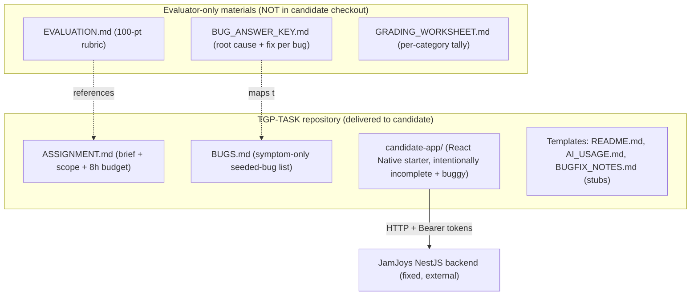
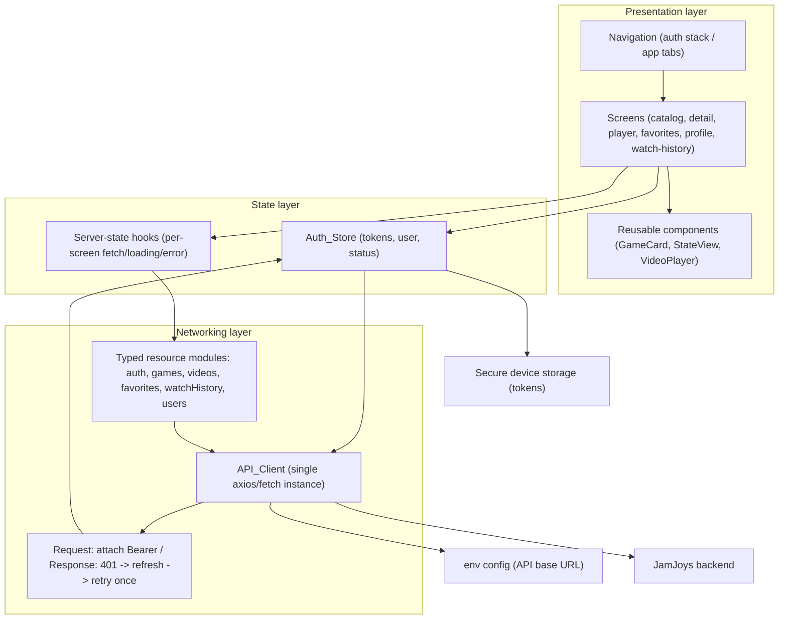
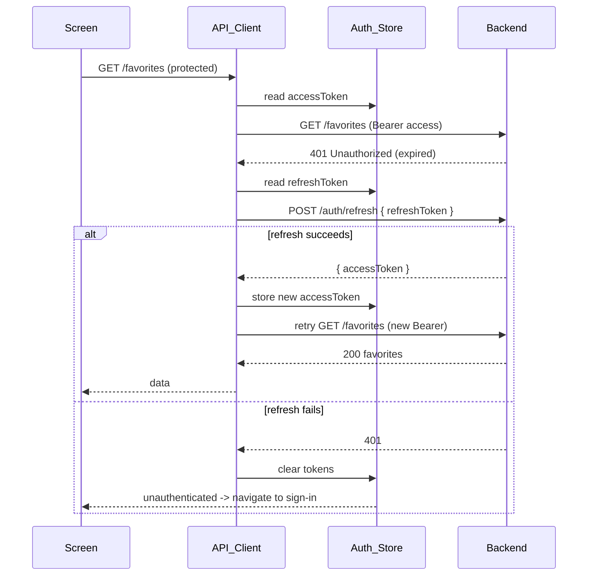

# Design Document

## Overview

This document describes **how to construct the `employment-frontend` assignment package**: a graded, one-working-day (~8 hour) take-home test in which a candidate builds a React Native mobile frontend that consumes the real JamJoys NestJS backend. The deliverable of *this* spec is not a shipping product — it is the **assignment package** plus a **standalone evaluation rubric** an evaluator uses to grade a candidate's completed work.

The assignment package has two audiences and therefore two distinct material sets:

1. **Candidate-facing materials** — a starter React Native repository the candidate clones and completes: project scaffold, environment configuration, a deliberately incomplete/buggy starting point, the assignment brief, the seeded-bug symptom list, and the templates the candidate must fill in (README, AI-usage log, bug-fix notes).
2. **Evaluator-facing materials** — a standalone `EVALUATION.md` rubric (100 points), a hidden seeded-bug answer key (root cause + fix per bug), and a grading worksheet. These are kept separate from the candidate repo so candidates never see scoring internals or bug solutions.

The design is intentionally **solution-guiding for the candidate** (it prescribes the architecture, layers, and screens the candidate is expected to follow) while remaining **prescriptive for the evaluator** (the answer key and rubric conditions are concrete and observable). This split matches Requirement 11 (symptom-only bug list, hidden answer key) and Requirement 12 (objective, observable rubric).

### Backend facts verified against the real codebase

These were confirmed by reading `/home/tgp-dev/Projects/JamJoys/backend/src` and must be reflected in the candidate brief and answer key so grading is accurate:

- **Phone format**: backend validates `^09\d{9}$` (`send-otp.dto.ts`). The candidate's client-side Iranian phone validation must accept this canonical form; normalization of `+98`/`0098` prefixes to `09xxxxxxxxx` is a reasonable candidate enhancement.
- **`POST /auth/send-otp`** returns `{ message, phoneNumber, expiresIn: 300, otp? }`. In non-production the `otp` is returned in the response and also logged to the server console (`📱 OTP for ...`), so the assignment is testable without a real SMS gateway. OTP expiry is **5 minutes**; verification allows **3 attempts** (`auth.service.ts`). The brief's "2 minutes / 3 attempts" framing should be corrected to **5 minutes / 3 attempts** to match the backend.
- **`POST /auth/verify-otp`** returns `{ user: { id, phoneNumber, avatar, role, isSubscribed, subscriptionExpiresAt }, accessToken, refreshToken }`.
- **`POST /auth/refresh`** takes `{ refreshToken }` and returns **only** `{ accessToken }` (no new refresh token). The client must keep reusing the stored refresh token until it expires (7d).
- **`POST /auth/logout`** and **`GET /auth/me`** require a Bearer token. `send-otp` is rate-limited to **1 request/minute**; `verify-otp` to **3/minute**.
- **Games**: `GET /games`, `GET /games/featured`, `GET /games/landing-page/data`, `GET /games/:slugOrId`, `POST /games/:id/view` (the view route uses `OptionalJwtAuthGuard` and `ParseUUIDPipe` — it requires a UUID id, not a slug). `GET /games` and `GET /games/:slugOrId` accept optional auth (richer data when authenticated).
- **Videos**: `GET /videos/:id` is public; `GET /videos/:id/stream` and `GET /videos/:id/validate-access` require auth. `validate-access` returns `{ hasAccess: boolean, message: string }`.
- **Users**: `GET /users/:id`, `PATCH /users/me`, `POST /users/me/avatar` (multipart `file`), `GET /users/me/token-balance`, `GET /users/me/subscription-status`. `GET /auth/me` is the canonical "current user" source.

### Goals

- Produce a candidate repo that installs and runs cleanly, scoped to ~8 hours.
- Force the candidate to demonstrate a centralized API client, OTP auth with token refresh, shared auth state, the core content screens, and disciplined loading/error/empty handling.
- Provide ≥5 seeded bugs across auth/API/state/UI with a symptom-only list for the candidate and a hidden answer key for the evaluator.
- Provide an objective 100-point rubric with full-credit vs partial-credit conditions per category.
- Capture AI-usage (Agent, Skills, Hooks, MCP, Steering) in a structured, gradeable template.

### Non-Goals

- Building the candidate's full application for them (the starter is intentionally incomplete).
- Modifying the JamJoys backend (it is a fixed external dependency).
- Implementing creator/upload/admin flows — the assignment covers consumer-facing screens only.
- Shipping the candidate app to an app store.

## Architecture

### Package-level architecture (what this spec produces)



The evaluator materials live in a directory excluded from the candidate's checkout (e.g., a separate `evaluator/` folder kept on a private branch or removed before handing over the repo). The design treats them as logically separate documents regardless of physical packaging.

### Candidate app architecture (what the candidate is expected to build)

The candidate app follows a layered architecture with one-directional dependencies: **UI screens → state stores → API client → backend**. No screen talks to the backend directly; no screen reads tokens directly from storage.



### Token lifecycle (the critical, most-graded flow)



A concurrency note for the answer key: the retry-once logic must guard against multiple parallel 401s each triggering their own refresh. The recommended pattern is a single in-flight refresh promise that all queued requests await.

### Technology guidance given to the candidate

The brief names a recommended stack but allows substitution as long as the layering holds:

- **React Native** via Expo (fastest path within 8h; bare RN allowed).
- **API client**: a single configured `axios` instance with request/response interceptors (or a fetch wrapper of equivalent capability).
- **State**: Zustand recommended for `Auth_Store` (small, persist-friendly); Redux Toolkit or React Context acceptable.
- **Navigation**: React Navigation (native stack + bottom tabs).
- **Token storage**: `expo-secure-store` (or `react-native-keychain` / `AsyncStorage` with a stated tradeoff).
- **Server state**: TanStack Query recommended for fetch/loading/error/pagination; manual hooks acceptable.
- **Language**: TypeScript recommended (Requirement 1.7 applies only WHERE TS is used).

## Components and Interfaces

### Candidate repository layout (starter)

```
TGP-TASK/
  ASSIGNMENT.md            # brief: context, scope, 8h budget, deliverables, submission steps
  BUGS.md                  # seeded-bug symptom list (symptom only, no causes)
  README.md                # STUB the candidate completes (Req 15)
  AI_USAGE.md              # STUB the candidate completes (Req 14)
  BUGFIX_NOTES.md          # STUB the candidate completes (Req 11.3/11.6)
  candidate-app/
    package.json           # pinned deps, scripts: start/android/ios/typecheck/test
    app.json / app.config  # Expo config
    .env.example           # EXPO_PUBLIC_API_BASE_URL=...
    .gitignore             # node_modules, build, .env
    tsconfig.json
    src/
      config/              # env access, constants (NO hard-coded base URL in screens)
      api/
        client.ts          # single instance + interceptors (seeded-bug surface)
        auth.api.ts
        games.api.ts
        videos.api.ts
        favorites.api.ts
        watchHistory.api.ts
        users.api.ts
        types.ts           # shared response/request types
      store/
        authStore.ts       # Auth_Store (tokens, user, status, persist)
      navigation/
        RootNavigator.tsx   # switches auth stack vs app tabs on auth status
        AuthStack.tsx
        AppTabs.tsx
      screens/
        auth/PhoneScreen.tsx
        auth/OtpScreen.tsx
        catalog/CatalogScreen.tsx
        catalog/GameDetailScreen.tsx
        video/VideoPlayerScreen.tsx
        favorites/FavoritesScreen.tsx
        favorites/WishlistScreen.tsx
        history/WatchHistoryScreen.tsx
        profile/ProfileScreen.tsx
      components/
        GameCard.tsx
        StateView.tsx       # loading / error+retry / empty (Req 10)
        VideoPlayer.tsx
      utils/
        phone.ts            # Iranian phone validation/normalization (pure, testable)
      __tests__/            # candidate tests (unit + the shipped property tests)
```

### Evaluator material layout (kept out of candidate checkout)

```
evaluator/
  EVALUATION.md            # standalone 100-pt rubric (Req 12)
  BUG_ANSWER_KEY.md        # per-bug: file, root cause, fix, verification step
  GRADING_WORKSHEET.md     # per-category score tally + notes
```

### API client interface (contract the candidate implements)

The starter ships these typed signatures (some intentionally broken — see seeded bugs). All functions return a typed result and throw/raise a structured `ApiError { status: number, message: string, data?: unknown }` on non-2xx (Requirement 2.3).

| Resource module | Function | Backend route |
|---|---|---|
| `auth.api` | `sendOtp(phoneNumber)` | `POST /auth/send-otp` |
| `auth.api` | `verifyOtp(phoneNumber, otp)` | `POST /auth/verify-otp` |
| `auth.api` | `refresh(refreshToken)` | `POST /auth/refresh` |
| `auth.api` | `logout()` | `POST /auth/logout` |
| `auth.api` | `me()` | `GET /auth/me` |
| `games.api` | `list(params)` | `GET /games` |
| `games.api` | `featured()` | `GET /games/featured` |
| `games.api` | `getBySlugOrId(slugOrId)` | `GET /games/:slugOrId` |
| `games.api` | `recordView(id)` | `POST /games/:id/view` (UUID id) |
| `videos.api` | `get(id)` | `GET /videos/:id` |
| `videos.api` | `validateAccess(id)` | `GET /videos/:id/validate-access` |
| `videos.api` | `stream(id)` | `GET /videos/:id/stream` |
| `favorites.api` | `list()` / `wishlist()` | `GET /favorites` / `GET /favorites/wishlist` |
| `favorites.api` | `add(gameId)` / `remove(gameId)` | `POST` / `DELETE /favorites/:gameId` |
| `favorites.api` | `check(gameId)` | `GET /favorites/:gameId/check` |
| `watchHistory.api` | `list()` / `record(videoId)` | `GET /watch-history` / `POST /watch-history/:videoId` |
| `users.api` | `get(id)` | `GET /users/:id` |
| `users.api` | `updateMe(patch)` | `PATCH /users/me` |
| `users.api` | `uploadAvatar(file)` | `POST /users/me/avatar` |
| `users.api` | `tokenBalance()` | `GET /users/me/token-balance` |
| `users.api` | `subscriptionStatus()` | `GET /users/me/subscription-status` |

### Screen-to-endpoint map (given to candidate and used by rubric)

| Screen | Primary endpoints | Key behaviors |
|---|---|---|
| PhoneScreen | `send-otp` | validate `09xxxxxxxxx`, disable submit in-flight |
| OtpScreen | `verify-otp` | 6-digit entry, persist tokens, error + re-entry |
| CatalogScreen | `GET /games` | list, loading, error+retry, empty, paginate on scroll |
| GameDetailScreen | `GET /games/:slugOrId`, `POST /games/:id/view`, `favorites/:gameId/check`, `POST`/`DELETE /favorites/:gameId` | detail, fire view on load, favorite toggle w/ optimistic revert |
| VideoPlayerScreen | `GET /videos/:id`, `validate-access`, `POST /watch-history/:videoId` | gate playback on access, periodic progress post |
| FavoritesScreen / WishlistScreen | `GET /favorites`, `GET /favorites/wishlist` | list + empty/error |
| WatchHistoryScreen | `GET /watch-history` | list previously watched |
| ProfileScreen | `GET /auth/me`, `PATCH /users/me`, `GET /users/me/token-balance` | view/edit, token balance, logout |

### Seeded-bug catalog design

The starter ships with **6 seeded bugs** (≥5 required by Req 11.1), one per category band, each with a stable identifier `BUG-01`..`BUG-06`. The candidate sees only symptoms (in `BUGS.md`); the evaluator holds root cause + fix in `BUG_ANSWER_KEY.md`.

| ID | Category | Candidate-visible symptom (BUGS.md) | Hidden root cause (answer key) | Verification after fix |
|---|---|---|---|---|
| BUG-01 | Auth | "After entering a valid OTP I'm briefly signed in, but on app restart I'm always logged out." | Tokens saved to in-memory state only; persistence to secure storage is never called (or hydration on launch is missing). | Kill & relaunch app → session restored (Req 4.2/4.3). |
| BUG-02 | API client | "Protected screens always show 401 even right after signing in." | `Authorization` header built as `"Bearer" + token` (missing space) or token read before it's set; header not attached. | Favorites/profile load with valid session (Req 2.2). |
| BUG-03 | API client / token lifecycle | "After ~15 minutes the app logs me out instead of refreshing." | Refresh interceptor calls refresh but doesn't apply the new `accessToken` to the retried request, or treats refresh's `{accessToken}`-only response as missing a refresh token and clears the session. | Force expiry → request transparently refreshes & succeeds (Req 4.4). |
| BUG-04 | State | "Toggling a favorite shows it as favorited, then it silently flips back / the wrong game gets favorited." | Optimistic update keyed by array index instead of `gameId`, and failure path doesn't revert. | Toggle favorite persists; failed toggle reverts (Req 8.1/8.6). |
| BUG-05 | UI / data mapping | "Game cards render blank titles/categories on the detail screen." | Reads legacy enum fields (`category`, `difficulty`) instead of config-object fields (`categoryConfig`, `difficultyConfig`) (Req 6.5). | Titles/categories render from `*Config` fields. |
| BUG-06 | UI / state | "The catalog spinner never disappears even after data loads (or it crashes on empty results)." | `loading` flag not cleared in a `finally`, or list maps over `undefined` when the response is empty. | Loading clears; empty state renders; no crash (Req 5.3/5.5/10.4). |

Bug distribution satisfies Req 11.1 (auth, API, state, UI all covered). Each fix is independently committable as a `fix:` Conventional Commit referencing its ID (Req 11.4).

### AI-usage tracking template (`AI_USAGE.md`)

The template is structured so the evaluator can score Req 14 objectively. Sections:

1. **Summary** — did you use an AI agent? (yes/no). If no, state so explicitly (Req 14.6).
2. **Agent usage log** — a table: `# | Task/prompt intent | Artifact produced | Accepted as-is / edited / rejected`.
3. **Feature usage matrix** — one row per Kiro feature type with explicit `Used? (Y/N)` and `Name`:
   | Feature | Used? | Name(s) | Task it supported | Observed effect |
   |---|---|---|---|---|
   | Skills | | | | |
   | Hooks | | | | |
   | MCP servers | | | | |
   | Steering | | | | |
4. **AI vs hand-written split** — per major artifact (API client, auth store, each screen, each bug fix), mark AI-generated / hand-written / mixed (Req 14.5).

### README template (`README.md`)

Stub headings map 1:1 to Requirement 15 so the evaluator checks presence/quality directly: Prerequisites & exact run commands (15.1); Backend base URL + env vars (15.2); Project structure + state-management choice (15.3); Implemented screens + endpoints each consumes (15.4); Links to `BUGFIX_NOTES.md` and `AI_USAGE.md` (15.5); a "Run on a clean checkout" walkthrough (15.6).

## Data Models

These are the request/response shapes the candidate codes against (subset relevant to the assignment, derived from the backend).

```ts
// Auth
type SendOtpReq = { phoneNumber: string };          // ^09\d{9}$
type SendOtpRes = { message: string; phoneNumber: string; expiresIn: number; otp?: string };
type VerifyOtpReq = { phoneNumber: string; otp: string }; // 6 digits
type AuthUser = {
  id: string; phoneNumber: string; avatar: string | null;
  role: string; isSubscribed: boolean; subscriptionExpiresAt: string | null;
};
type VerifyOtpRes = { user: AuthUser; accessToken: string; refreshToken: string };
type RefreshReq = { refreshToken: string };
type RefreshRes = { accessToken: string };           // NOTE: no new refresh token

// Auth_Store persisted shape
type AuthState = {
  accessToken: string | null;
  refreshToken: string | null;
  user: AuthUser | null;
  status: 'unknown' | 'authenticated' | 'unauthenticated';
};

// Games (fields the UI must read; richer object exists server-side)
type Game = {
  id: string; slug: string; title: string; description: string;
  thumbnail: string | null;
  categoryConfig?: Record<string, unknown>;   // use these, NOT legacy `category`
  difficultyConfig?: Record<string, unknown>;
  videos?: Video[];
};
type Paginated<T> = { data: T[]; total: number; page: number; limit: number };

// Videos
type Video = { id: string; title: string; description?: string; duration?: number; thumbnail?: string | null };
type ValidateAccessRes = { hasAccess: boolean; message: string };

// Favorites / watch history
type FavoriteCheckRes = { isFavorite: boolean };
type WatchHistoryItem = { videoId: string; progress: number; updatedAt: string; video?: Video };

// Users
type TokenBalanceRes = { balance: number };

// Standard client error
type ApiError = { status: number; message: string; data?: unknown };
```

Note on shapes: exact field names for some list/paginate responses may vary; the brief instructs the candidate to inspect actual responses (the backend returns the dev OTP and logs it, making this practical) and the rubric grades **behavior**, not exact field guesses.

## Correctness Properties

*A property is a characteristic or behavior that should hold true across all valid executions of a system — essentially, a formal statement about what the system should do. Properties serve as the bridge between human-readable specifications and machine-verifiable correctness guarantees.*

These properties target the **pure, input-varying logic of the candidate app** — the API client behavior, auth/token lifecycle, phone validation, pagination accumulation, data mapping, access gating, optimistic favorites, and error rendering. They are shipped as a small property-test suite in the starter (some covering the seeded-bug surfaces), so both candidate and evaluator can run them. Document structure, rubric scoring, git workflow, and live-API integration criteria are intentionally excluded (validated by inspection, smoke, or integration tests — see Testing Strategy).

### Property 1: Bearer header is well-formed for any token

*For any* non-empty access-token string, when the API client issues a protected request, the outgoing `Authorization` header equals exactly `Bearer ${token}` (a single space, the unmodified token).

**Validates: Requirements 2.2**

### Property 2: Non-2xx responses become structured errors

*For any* HTTP status code in the 400–599 range and *any* backend response body, the API client raises a structured `ApiError` whose `status` equals the response status and whose `message` is a non-empty string derived from the body.

**Validates: Requirements 2.3**

### Property 3: Phone validation gates the backend call

*For any* input string, the sign-in flow calls `send-otp` if and only if the string matches the canonical Iranian mobile format (`09` followed by 9 digits); for every non-matching string it shows a validation message and makes no backend call.

**Validates: Requirements 3.2**

### Property 4: Token persistence round-trips and restores the session

*For any* access token, refresh token, and user object, persisting them to device storage and then rehydrating the Auth_Store on a fresh launch yields identical tokens and user and a status of `authenticated`.

**Validates: Requirements 4.2, 4.3**

### Property 5: A single 401 triggers exactly one refresh and one retry with the new token

*For any* protected request that first responds 401 and then succeeds, the API client performs exactly one `POST /auth/refresh`, retries the original request exactly once carrying the newly issued access token, and resolves with the success result; if the refresh fails, the Auth_Store ends with no tokens and status `unauthenticated`, and no infinite retry loop occurs.

**Validates: Requirements 4.4, 4.5**

### Property 6: Pagination append preserves order and contents

*For any* list of games partitioned into ordered pages, loading the pages sequentially as the user scrolls produces a combined list equal to the in-order concatenation of those pages, with no dropped or duplicated items.

**Validates: Requirements 5.6**

### Property 7: Game display reads configuration fields, not legacy enums

*For any* game object containing `categoryConfig` / `difficultyConfig`, the display mapper derives category and difficulty values from those configuration fields and never from the legacy `category` / `difficulty` enum fields.

**Validates: Requirements 6.5**

### Property 8: Video playback is gated strictly by access

*For any* `validate-access` response `{ hasAccess, message }`, playback begins if and only if `hasAccess` is true; when it is false the player does not start and the explanatory message is shown.

**Validates: Requirements 7.2, 7.3**

### Property 9: Optimistic favorite is keyed by gameId and reverts on failure

*For any* list of games and *any* target gameId, an optimistic favorite toggle that fails reverts exactly that game's favorite state to its prior value and leaves every other game unchanged; a toggle that succeeds keeps the new state. The affected game is identified by `gameId`, never by list position.

**Validates: Requirements 8.1, 8.6**

### Property 10: Error view always renders a human-readable message

*For any* `ApiError { status, message }`, the shared error state view renders a non-empty, human-readable message reflecting the error (never a blank or `undefined` render).

**Validates: Requirements 10.2**

## Error Handling

The assignment's error story spans both the package construction and the candidate app's runtime behavior.

### Candidate-app error handling (what the candidate must implement, and the rubric grades)

- **Centralized translation**: the API client converts every non-2xx response and every transport failure (timeout, no network) into a single `ApiError { status, message, data? }` type (Req 2.3, 2.4). Callers never see raw axios/fetch errors.
- **Token-refresh failure**: on a 401 the client attempts one refresh+retry; if refresh fails it clears tokens and the navigator drops the user to sign-in (Req 4.4, 4.5). A single in-flight refresh promise prevents a stampede of parallel refreshes.
- **Per-screen states**: every content screen renders one of loading / error+retry / empty / data via the shared `StateView` component (Req 5.3–5.5, 6.4, 9.4, 10.1–10.3). Retry controls re-invoke the original request.
- **Optimistic mutations revert**: favorite/wishlist toggles apply optimistically and roll back on failure, keyed by `gameId` (Req 8.6).
- **Crash containment**: a single failed request must never crash the app (Req 10.4); list renderers must tolerate empty/`undefined` data, and an error boundary backstops unexpected throws.
- **Input validation before I/O**: invalid Iranian phone numbers and non-6-digit OTPs are rejected client-side before any network call (Req 3.2).

### Package/evaluator error handling (robustness of the assignment itself)

- **Backend availability**: the brief documents how to start the JamJoys backend and that non-production `send-otp` returns the OTP in its response and logs it to the console, so the candidate is never blocked by a missing SMS gateway.
- **Spec/brief drift**: where the brief's prose disagreed with the real backend (OTP validity window), the design corrects it to the verified value (5-minute expiry, 3 attempts) so candidates are not graded against a wrong expectation.
- **Answer-key isolation**: the seeded-bug answer key and rubric internals are physically separated from the candidate checkout so a candidate cannot accidentally receive solutions.

## Testing Strategy

This feature mixes document deliverables, a React Native UI, live API integration, and a pocket of pure logic. The testing approach is therefore layered, and **property-based testing is applied only to the pure logic layer**, where "for all inputs" statements are meaningful and cheap to run.

### Property-based tests (candidate-app pure logic)

PBT **is** appropriate here for the 10 properties above: they are pure functions or thin units (header building, error mapping, phone validation, store hydration, refresh/retry sequencing over a mocked transport, pagination merge, field mapping, access gating, optimistic reducer, error-message rendering). The starter ships these as a property suite.

- Library: **fast-check** with the Jest/Vitest runner used by the React Native project. The candidate must not hand-roll a generator framework.
- Each property test runs a **minimum of 100 iterations**.
- Each test is tagged with a comment referencing its design property, in the format: **Feature: employment-frontend, Property {number}: {property_text}**.
- Each correctness property is implemented by a **single** property-based test.
- External I/O (HTTP, secure storage) is replaced with in-memory mocks so properties test logic, not the network.
- Several properties double as seeded-bug regression tests (P3↔BUG-?, P4↔BUG-01, P1/P5↔BUG-02/BUG-03, P9↔BUG-04, P7↔BUG-05, P6/P10↔BUG-06): a candidate who fixes the bug should see the corresponding property go green.

### Unit and component tests (example/edge)

- **Example tests** for UI wiring criteria: each screen calls the right endpoint on mount/action and renders returned data (Req 3.1, 3.3, 3.4, 5.1, 6.1, 7.1, 8.x, 9.x). Use React Native Testing Library with a mocked API client.
- **Edge-case tests** for error/empty/denied branches (Req 3.6, 5.4, 5.5, 6.4, 7.3, 9.4, 10.3, 10.4) and the timeout/no-hang behavior (Req 2.4).
- These focus on specific behaviors and edges; broad input coverage is left to the property suite to avoid redundant unit tests.

### Integration tests (live backend, 1–3 examples)

- A thin integration test that runs the OTP happy path against a locally running JamJoys backend: `send-otp` (read the returned dev `otp`) → `verify-otp` → use the access token on `GET /auth/me`. This verifies real wiring and route correctness (Req 2.6) without being run hundreds of times.
- Optionally one games-list fetch to confirm the catalog endpoint shape.

### Smoke / inspection checks (package and structure criteria)

- **Smoke**: clean-checkout `install` succeeds (Req 1.2, 1.3); TypeScript `typecheck` passes where TS is used (Req 1.7); the app boots (Req 15.6); `EVALUATION.md` exists and its nine categories sum to 100 (Req 12.1).
- **Inspection** (by the evaluator, encoded as rubric line items): separated source structure (Req 1.4), env-based base URL with no hard-coded literals (Req 1.5), `.gitignore` contents (Req 1.6, 13.5), single API-client module (Req 2.1), feature-branch + Conventional-Commit git history with a PR-style merge (Req 13.1–13.4), AI-usage log completeness (Req 14.x), and README completeness (Req 15.1–15.5).

### Why PBT is scoped narrowly here

Most of this spec is documents (rubric, brief, answer key), UI rendering, and live API integration — none of which yield meaningful universal "for all inputs" statements, so they use snapshot/example/integration/inspection strategies instead. The candidate app nonetheless contains genuinely property-bearing logic (validation, serialization-like persistence round-trips, refresh sequencing, accumulation, mapping), and those are exactly the surfaces the seeded bugs target — so a focused property suite is both high-value and aligned with the grading objectives.

---

## EVALUATION.md Rubric Design (standalone evaluator document)

`EVALUATION.md` is delivered as a **standalone** document so the evaluator can grade without reading the brief or source. It opens with grading instructions (run from a clean checkout, follow the candidate README, consult the answer key only for the bug category) and then nine scored sections totaling **100 points**. Each section states the **observable full-credit condition** and **partial-credit gradations**, and instructs the evaluator to assign **0** when the underlying deliverable is absent (Req 12.3).

### Scoring categories and observable conditions

| # | Category | Points | Full credit (observable) | Partial credit | Zero |
|---|---|---|---|---|---|
| 1 | Project setup & structure | 10 | Installs on clean checkout with documented command; clear separation of api/state/navigation/screens/components/config; env-based base URL; sensible `.gitignore`; TS typechecks if used | Installs but structure muddled, or base URL partly hard-coded, or minor typecheck errors | App does not install/run; no recognizable structure |
| 2 | API client layer | 10 | Single reusable client; Bearer attached; non-2xx → structured error; timeout handled; typed per-resource functions hitting exact routes | Client exists but used inconsistently, or errors unstructured, or some routes wrong | No central client; screens call HTTP directly everywhere |
| 3 | Auth & state management | 20 | OTP send/verify works; both tokens persisted; session restores after restart; 401 → refresh+retry once; refresh-fail → sign-in; logout clears; protected routes guarded; shared store | Auth works but no persistence, or no refresh, or guards missing (scale within 0–20 by how many sub-behaviors hold) | No working auth or no shared state |
| 4 | Core screens & features | 25 | Catalog, detail (+view), video playback (+access gate, progress), favorites/wishlist, watch history, profile (+token balance, edit) all functional against backend | Subset of screens functional; grade proportionally across the six screen groups | No functional content screens |
| 5 | Error & loading handling | 10 | Every content screen shows loading, error+retry, and empty states; no crash on a failed request | Some screens handle states, others don't | No state handling; crashes on error |
| 6 | Seeded-bug fixing | 10 | All ≥5 documented symptoms resolved; each fix a separate `fix:` commit referencing the bug id; root cause + AI/hand split recorded in BUGFIX_NOTES | Some bugs fixed/documented (≈2 pts per correctly fixed+documented bug, capped at 10) | No bugs fixed or no notes |
| 7 | Git workflow | 5 | Feature branches, Conventional Commits, coherent commit granularity, PR-style merge, secrets/deps excluded | Mostly direct-to-main or inconsistent messages | Single dump commit / secrets committed |
| 8 | AI-usage documentation | 5 | AI_USAGE.md records agent use with prompt intent + artifacts, the Skills/Hooks/MCP/Steering matrix with names and effects, and AI-vs-hand split (or explicit "none") | Present but incomplete (missing feature matrix or split) | Missing |
| 9 | README quality | 5 | Run/setup commands, env config, structure + state choice, screens↔endpoints, links to notes & AI log; evaluator can launch without reading source | Present but evaluator must read source to run | Missing or unusable |

Stretch goals (e.g., offline cache, animations, additional screens) are recorded **separately** and never push the total past 100 (Req 12.5).

### Seeded-bug answer key (`BUG_ANSWER_KEY.md`, evaluator-only)

For each of `BUG-01`..`BUG-06`, the answer key records: the candidate-visible symptom (mirrors `BUGS.md`), the exact file/location, the root cause, the minimal correct fix, and the post-fix verification step. The catalog in the Components section above is the source content for this key; in the candidate-facing `BUGS.md` only the **symptom** column is published (Req 11.2).
